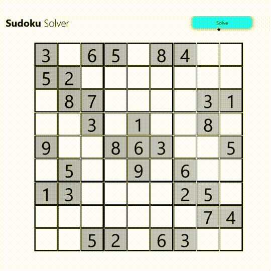

# Sudoku Solver App

This repository contains a Sudoku Solver application built using React. The app allows you to input a Sudoku puzzle and automatically solves it using a backtracking algorithm.

## Getting Started

To get started with the Sudoku Solver app, follow these steps:

1. Clone the repository to your local machine:

   ```bash
   git clone https://github.com/SujalChoudhari/SudokuSolver.git
   ```

2. Navigate to the project directory:

   ```bash
   cd SudokuSolver
   ```

3. Install the required dependencies:

   ```bash
   npm install
   ```

4. Start the development server:

   ```bash
   npm start
   ```

5. Open your web browser and visit `http://localhost:3000` to access the Sudoku Solver app.

## Usage

1. Enter the initial Sudoku puzzle values by clicking on the cells and typing the numbers.

2. Click the "Solve" button to start the solving process. The app will attempt to find a solution to the puzzle using a backtracking algorithm.

3. Once the puzzle is solved, the solved numbers will be displayed on the grid.

## Technologies Used

- React: A JavaScript library for building user interfaces.
- CSS: Stylesheets for formatting the app's layout and appearance.

## Solving



## Acknowledgments

This app was created as a fun project to explore React and practice problem-solving techniques.

## Contact

For any questions or feedback, feel free to reach out to me on GitHub: [@SujalChoudhari](https://github.com/SujalChoudhari)